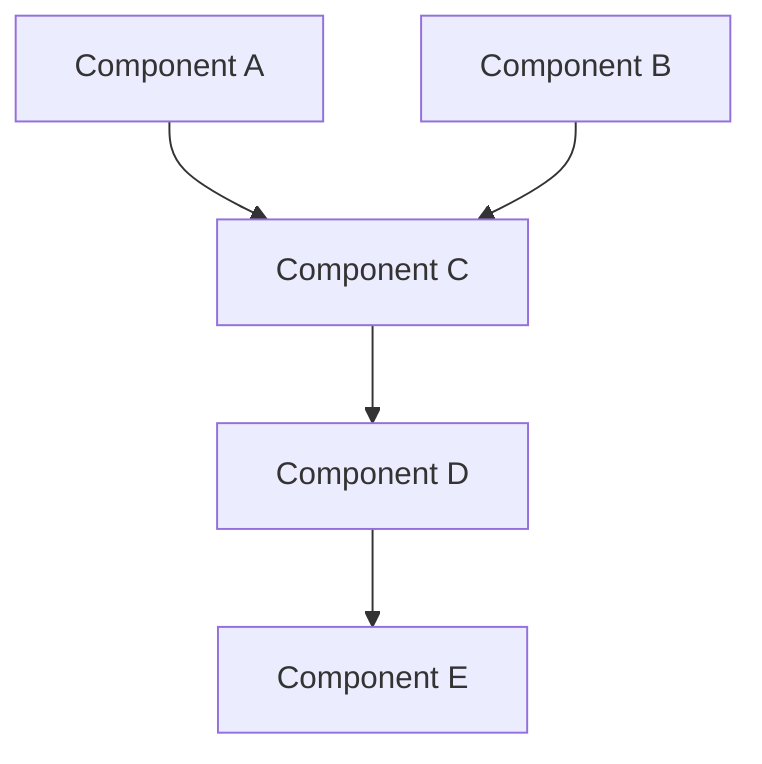

# BEAD Method - Structured Component Planning & Development

BEAD methodology for systematic component planning, development, and reporting.

**BEAD = Break down + Explain + Analyze + Document**

## What is BEAD?

A structured approach to building software components:

### B - Break down (Phân tách)
- Break the big feature into small components
- Each component should do ONE thing well
- Identify clear boundaries between components

### E - Explain (Giải thích)
- Explain what each component does
- Explain WHY it's needed in the bigger picture
- Explain HOW it fits with other components

### A - Analyze (Phân tích)
- Analyze inputs and outputs of each component
- Analyze dependencies (what comes before/after)
- Analyze risks and edge cases

### D - Document (Tài liệu hóa)
- Document the plan BEFORE coding
- Document the results AFTER testing
- Document lessons learned

## bd Tool Integration

BEAD method now integrates with `bd` (beads) - a dependency-aware issue tracker.

### Why use bd?
- Track component dependencies automatically
- Show ready work (no blockers)
- Auto-sync with git (JSONL files in `.beads/`)
- Perfect for AI-supervised workflows

### Initialization
```bash
bd init  # Run once per project
```

### Basic Workflow
```bash
# Create component issue
bd create --title "Implement ConstructionExtractor" --type task --priority 0

# Add dependency (parent-id blocks child-id)
bd dep add child-issue-id parent-issue-id

# Show ready work
bd ready

# Update status
bd update issue-id --status in_progress

# Close when done
bd close issue-id
bd sync  # Sync to git
```

## Usage Modes

This skill has 3 modes of operation:

### Mode 1: Planning Only

When you want to plan components without implementing yet:

**User says:** "I want to plan a payment processing system"

**You should:**
1. Ask user about feature requirements
2. Break down into components using BEAD principles
3. Create `task_[component].md` for each component in `report_component_task/`
4. Create `task_00_overview.md` with dependency graph
5. List build order
6. Identify missing information

### Mode 2: Implementation Only

When you want to implement a component that's already planned:

**User says:** "Implement the user_authentication component"

**You should:**
1. Read `task_user_authentication.md` plan from `report_component_task/`
2. Verify dependencies are complete
3. Implement the component
4. Write tests with REAL data
5. Run all tests
6. Fix any issues
7. Update the plan file with Implementation Report section
8. Update `task_00_overview.md` status table

### Mode 3: Full Cycle

When you want to both plan AND implement:

**User says:** "Build a user management system"

**You should:**
1. Do planning phase (create all plans)
2. Ask user to review plans
3. Implement components in dependency order
4. Test each component
5. Report each component
6. Create final summary report

## Planning Phase

### 1. Create Component Plan

**Step 1: Create bd issue**
```bash
bd create --title "[Component Name]" \
  --type task \
  --priority [0-4] \
  --description "Component description" \
  --labels "planning,component"
```

**Step 2: Create plan document**

For each component, create: `report_component_task/task_[component_name].md`

**Template:**

```markdown
# BEAD Plan: [Component Name]

## Component Purpose

### What It Does
[Clear explanation of what this component does]

### Why It's Needed
[Explain the purpose in the bigger picture]

### Where It Fits
[Explain how it contributes to the overall system]

## Input Specification

### Input Parameters
| Parameter | Type | Required | Description | Example | Validation |
|-----------|------|----------|-------------|---------|------------|
| param1    | str  | Yes      | User email  | user@example.com | Email format |
| param2    | int  | No       | Age         | 25      | > 0, < 150 |

### Input Source
- Where does this data come from?
- Which component provides it?
- What format is it in?

### Input Validation Rules
1. Rule 1: [Description]
2. Rule 2: [Description]

## Output Specification

### Output Structure
```python
{
    "status": "success" | "error",
    "data": {
        "field1": "value",
        "field2": 123
    },
    "metadata": {
        "timestamp": "2026-01-28T10:30:00Z",
        "version": "1.0"
    }
}
```

### Success Response
- What fields are returned on success?
- What data types?
- What does each field mean?

### Error Response
- What error codes are possible?
- What error messages?
- How should caller handle each error?

### Output Consumers
- Which components use this output?
- How do they use it?

## Dependencies & Build Order

### Depends On (Must Build First)
1. **Component A** - Needed because [reason]
   - Uses: [what data/functionality]
   - Status: ✅ Complete / 🔄 In Progress / ⏳ Not Started

2. **Component B** - Needed because [reason]
   - Uses: [what data/functionality]
   - Status: ✅ Complete / 🔄 In Progress / ⏳ Not Started

### Depended On By (Build These After)
1. **Component X** - Will use this for [purpose]
2. **Component Y** - Will use this for [purpose]

### Build Priority
- Priority: High / Medium / Low
- Suggested build order: #[number] out of [total]
- Blocking: [list of components blocked by this]

## Component Relationships

### Data Flow
```
[Component A]
     ↓ (provides: user_id, email)
[THIS COMPONENT]
     ↓ (provides: auth_token, permissions)
[Component B]
```

### Interaction Pattern
- Synchronous / Asynchronous
- Request-Response / Event-Driven / Streaming
- Timing requirements: [if any]

## Implementation Plan

### Complexity Assessment
- Complexity Level: Simple / Medium / Complex
- Estimated Effort: [hours/days]
- Risk Level: Low / Medium / High

### Technical Approach
1. Step 1: [What to do]
2. Step 2: [What to do]
3. Step 3: [What to do]

### Key Algorithms/Patterns
- Algorithm/Pattern 1: [Why chosen]
- Algorithm/Pattern 2: [Why chosen]

### Technology Stack
- Language/Framework: [choice and why]
- Libraries needed: [list with versions]
- External services: [if any]

## Edge Cases & Risks

### Edge Cases to Handle
1. Empty input
2. Null values
3. Invalid format
4. Duplicate data
5. [Add more specific to component]

### Potential Risks
1. **Risk**: [Description]
   - **Impact**: High / Medium / Low
   - **Mitigation**: [How to prevent/handle]

### Error Scenarios
1. Scenario: [Description]
   - Expected behavior: [What should happen]
   - Fallback: [What to do if it fails]

## Testing Strategy

### Test Cases Planned
1. **Normal Case**: [Description]
   - Input: [Specific test data]
   - Expected output: [Exact expectation]

2. **Edge Case**: [Description]
   - Input: [Specific test data]
   - Expected output: [Exact expectation]

3. **Error Case**: [Description]
   - Input: [Specific test data]
   - Expected output: [Exact expectation]

### Integration Tests
- Test with Component A: [What to verify]
- Test with Component B: [What to verify]

### Performance Tests
- Load test: [Requirements]
- Stress test: [Requirements]
- Benchmark: [Target metrics]

## Missing Information

### Questions to Answer Before Implementation
1. [Question 1]
2. [Question 2]

### Information Needed
1. [What info is needed]
   - Source: [Where to get it]
   - Impact: [What can't be done without it]

## Notes
- Any additional planning notes
- Assumptions made
- Alternatives considered
```

### 2. Create Overview Document

Create `report_component_task/task_00_overview.md`:

```markdown
# BEAD Project Overview: [Feature Name]

## Component Dependency Graph



## Build Order

### Phase 1: Foundation
1. Component A (no dependencies)
2. Component B (no dependencies)

### Phase 2: Core Logic
3. Component C (depends on: A, B)

### Phase 3: Integration
4. Component D (depends on: C)

### Phase 4: Finalization
5. Component E (depends on: D)

## Component Summary Table

| # | Component | Purpose | Input | Output | Dependencies | bd Issue | Status |
|---|-----------|---------|-------|--------|--------------|----------|--------|
| 1 | Component A | [Brief] | [Types] | [Types] | None | `chaos-auto-prompt-xxx` | ⏳ |
| 2 | Component B | [Brief] | [Types] | [Types] | None | `chaos-auto-prompt-yyy` | ⏳ |
| 3 | Component C | [Brief] | [Types] | [Types] | A, B | `chaos-auto-prompt-zzz` | ⏳ |

## Overall Architecture

[High-level description of how all components work together]

## bd Dependency Setup

```bash
# Link dependencies in bd
bd dep add chaos-auto-prompt-zzz chaos-auto-prompt-xxx  # C depends on A
bd dep add chaos-auto-prompt-zzz chaos-auto-prompt-yyy  # C depends on B

# Verify dependency tree
bd dep tree chaos-auto-prompt-zzz
```
```

## Implementation Phase

After planning is complete, implement components following the build order.

For each component:

### 1. Check Dependencies
```bash
# Show ready work (no blockers)
bd ready

# Show this component's blockers
bd show [issue-id]

# Verify blockers are closed
bd dep tree [issue-id]
```

### 2. Mark as In Progress
```bash
bd update [issue-id] --status in_progress
```

### 3. Read the Plan
- Review `task_[component_name].md`
- Understand inputs, outputs, dependencies

### 4. Verify Dependencies
- Check all required components are complete
- If not, build dependencies first

### 5. Implement
- Follow the technical approach from plan
- Use logging (not print)
- Add error handling
- Validate inputs

### 6. Test (CRITICAL)
- Use REAL test cases from the plan
- Do NOT use dummy data
- Test all scenarios planned
- Test integration with dependencies

### 7. Update Plan Document
- Change status from "Plan" to "Implemented"
- Add "Implementation Report" section

### 8. Close Issue
```bash
# Mark component complete
bd close [issue-id]

# Sync to git
bd sync
```

### 9. Update Overview
- Update status in `task_00_overview.md` table
- Update mermaid diagram if needed

## Reporting Phase

After testing succeeds, update `task_[component_name].md` with:

```markdown
---

# Implementation Report

## Status
✅ **COMPLETED AND TESTED** - [Date]

## What Was Built

### Files Created/Modified
- `src/module/component.py` - Main implementation
- `tests/test_component.py` - Test suite
- [Other files]

### Code Location
- Main logic: `src/module/component.py:45-120`
- Helper functions: `src/module/helpers.py:10-30`
- Tests: `tests/test_component.py`

## How It Works (Implementation)

### Step-by-Step Flow
1. [What happens first]
2. [What happens next]
3. [Final step]

### Key Code Snippets
```python
# Core logic explanation
def main_function(param1, param2):
    logger.info(f"Processing {param1}")
    # ...
```

### Logging Integration
- Log level used: INFO
- Log format: [Show example]
- Log messages: [List key log messages]

## Test Results

### Test Execution
```bash
$ pytest tests/test_component.py -v
✅ test_normal_case PASSED
✅ test_edge_case_empty_input PASSED
✅ test_error_invalid_format PASSED
✅ test_integration_with_component_a PASSED

Coverage: 95%
```

### Detailed Test Results

#### Test 1: Normal Case
- **Input**: `{"email": "user@example.com", "age": 25}`
- **Expected**: `{"status": "success", "user_id": "12345"}`
- **Actual**: `{"status": "success", "user_id": "12345"}`
- **Status**: ✅ PASS
- **Notes**: All validations passed correctly

#### Test 2: Edge Case - Empty Input
- **Input**: `{}`
- **Expected**: `ValidationError: Missing required field 'email'`
- **Actual**: `ValidationError: Missing required field 'email'`
- **Status**: ✅ PASS
- **Notes**: Error handling works as expected

[Continue for all test cases]

### Test Coverage
- Line coverage: 95%
- Branch coverage: 88%
- Untested lines: 102-105 (error handling for rare case)
- Reason for gaps: [Explanation]

## Issues Encountered

### Issue 1: [Title]
- **Problem**: [What went wrong]
- **Cause**: [Why it happened]
- **Detection**: [How it was found - which test case]
- **Solution**: [How it was fixed]
- **Code changed**: `file.py:45-50`
- **Lesson learned**: [What to do differently next time]

### Issue 2: Missing Information
- **What was needed**: [Description]
- **Impact**: [What couldn't be tested/implemented]
- **Workaround**: [Temporary solution]
- **Action needed**: [What needs to be provided]

## Performance Metrics

### Actual Performance
- Average execution time: 45ms
- Peak memory usage: 12MB
- Throughput: 500 requests/second

### Comparison to Plan
- Target: 50ms - ✅ ACHIEVED (45ms)
- Memory target: 20MB - ✅ ACHIEVED (12MB)

## Integration Verification

### Tested With
1. **Component A**
   - Integration point: [Where they connect]
   - Test result: ✅ PASS
   - Data exchange verified: Yes

2. **Component B**
   - Integration point: [Where they connect]
   - Test result: ✅ PASS
   - Data exchange verified: Yes

### Downstream Impact
- Components X, Y, Z can now proceed
- Unblocked tasks: [List]

## Production Readiness Checklist

- [x] All tests passing (100%)
- [x] Code coverage > 80%
- [x] Logging implemented (no print statements)
- [x] Error handling complete
- [x] Input validation complete
- [x] Type hints added
- [x] Docstrings complete
- [x] Dead code removed
- [x] Security review done
- [x] Performance acceptable
- [x] Integration tests pass
- [x] Documentation complete

## Deployment Notes

### Configuration Required
- Environment variables: [List]
- Config files: [List]
- Database migrations: [If any]

### Monitoring
- Key metrics to watch: [List]
- Alert thresholds: [Define]
- Dashboard location: [If applicable]

## Next Steps

1. [What should be done next]
2. [Future improvements identified]
3. [Related components to update]

## Lessons Learned

### What Went Well
- [Point 1]
- [Point 2]

### What Could Be Improved
- [Point 1]
- [Point 2]

### Recommendations for Future Components
- [Recommendation 1]
- [Recommendation 2]
```

## Important Rules

- Each component = 1 plan document
- Plan MUST specify clear input/output with field names and types
- Plan MUST show relationships and dependencies
- Plan MUST define build order
- NEVER use dummy test data - use real scenarios
- Report MUST document actual test results
- Report MUST document issues encountered
- Report MUST specify what information is missing (if any)
- Update overview document after each component is complete

## Example Component Names

✅ **Good naming:**
- `user_authentication`
- `data_validator`
- `email_sender`
- `payment_processor`

❌ **Bad naming:**
- `handler` (too vague)
- `utils` (not a component)
- `stuff` (meaningless)

## Tools Available

Use these tools during BEAD workflow:
- Read - Read existing plans and code
- Write - Create new plan documents
- Edit - Update plans with implementation results
- Bash - Run tests and bd commands
- Glob - Find related files
- Grep - Search for dependencies
- AskUserQuestion - Clarify requirements during planning

**Note:** TodoWrite is replaced by bd tool for task tracking.

## bd Quick Reference

### Component Workflow
```bash
# 1. Create component issue
bd create --title "ComponentName" --type task --description "Description" --priority 2

# 2. Add dependencies (parent-id blocks child-id)
bd dep add child-id parent-id

# 3. Show ready work
bd ready

# 4. Start work
bd update issue-id --status in_progress

# 5. Finish work
bd close issue-id
bd sync
```

### Useful Commands
```bash
bd list                    # List all issues
bd list --status open      # Filter by status
bd show issue-id           # Show details
bd dep tree issue-id       # Show dependency tree
bd ready                   # Show unblocked work
bd stats                   # Database overview
bd blocked                 # Show all blocked issues
```

### Issue Types
- `task`: Regular component work
- `epic`: Large features
- `bug`: Fixes
- `chore`: Maintenance

### Priority Levels
- `0` or `P0`: Critical
- `1` or `P1`: High
- `2` or `P2`: Medium (default)
- `3` or `P3`: Low
- `4` or `P4`: Backlog

### Dependencies
- `blocks`: Hard blocker (use `bd dep add` to create)
- `related`: Soft connection
- `parent-child`: Hierarchical

### Example: Multi-Component Setup
```bash
# Create all components
bd create --title "DataValidator" --type task --priority 1
bd create --title "EmailSender" --type task --priority 1
bd create --title "PaymentProcessor" --type task --priority 0

# Link dependencies
# PaymentProcessor depends on DataValidator and EmailSender
bd dep add chaos-auto-prompt-xxx chaos-auto-prompt-aaa  # PaymentProcessor depends on DataValidator
bd dep add chaos-auto-prompt-xxx chaos-auto-prompt-bbb  # PaymentProcessor depends on EmailSender

# Show what's ready to work on
bd ready

# Show dependency tree
bd dep tree chaos-auto-prompt-xxx
```
