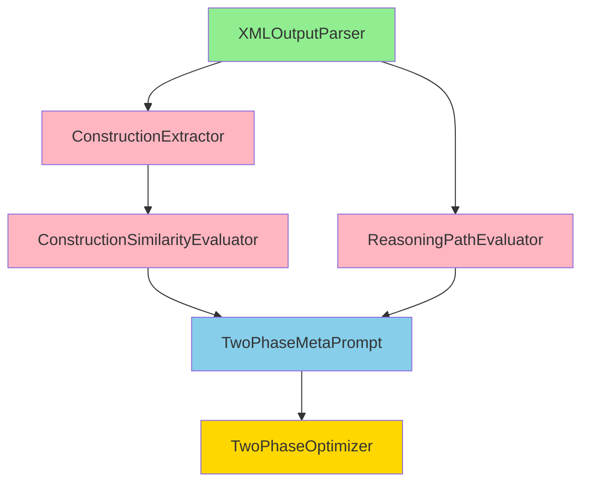

# BEAD Project Overview: 2-Phase Meta-Prompt Optimization System

## Component Dependency Graph



## Build Order

### Phase 1: Foundation (No Dependencies)
1. **XMLOutputParser** - Parse `<construction>` and `<think>` tags from LLM output
   - Priority: P0 (Critical)
   - Complexity: Simple
   - Effort: 2-4 hours

### Phase 2: Core Extraction & Evaluation (Depends on Phase 1)
2. **ConstructionExtractor** - Extract entities, state variables, actions, constraints
   - Priority: P1 (High)
   - Complexity: Medium
   - Effort: 6-8 hours

3. **ReasoningPathEvaluator** - Evaluate reasoning logic paths (parallel with #2)
   - Priority: P1 (High)
   - Complexity: Complex
   - Effort: 10-14 hours

### Phase 3: Similarity & Quality Assessment (Depends on Phase 2)
4. **ConstructionSimilarityEvaluator** - Measure construction similarity (90% threshold)
   - Priority: P1 (High)
   - Complexity: Complex
   - Effort: 8-12 hours

### Phase 4: Meta-Prompt Builder (Depends on Phase 3)
5. **TwoPhaseMetaPrompt** - Build optimized meta-prompts with examples
   - Priority: P1 (High)
   - Complexity: Medium
   - Effort: 6-8 hours

### Phase 5: Training Orchestrator (Depends on All)
6. **TwoPhaseOptimizer** - Main 2-phase training pipeline
   - Priority: P2 (Normal)
   - Complexity: Complex
   - Effort: 12-16 hours

**Total Estimated Effort:** 44-62 hours

## Component Summary Table

| # | Component | Purpose | Input | Output | Dependencies | bd Issue | Status |
|---|-----------|---------|-------|--------|--------------|----------|--------|
| 1 | XMLOutputParser | Parse XML tags from LLM output | Raw text, tag_name | Extracted content dict | None | `chaos-auto-prompt-4n7` | ⏳ |
| 2 | ConstructionExtractor | Extract 4 construction elements | Construction text | Structured elements dict | XMLOutputParser | `chaos-auto-prompt-tts` | ⏳ |
| 3 | ConstructionSimilarityEvaluator | Measure construction similarity | Generated + groundtruth constructions | Similarity score (0-1), feedback | ConstructionExtractor | `chaos-auto-prompt-ro2` | ⏳ |
| 4 | ReasoningPathEvaluator | Evaluate reasoning logic paths | Reasoning text, answer, paths DB | Quality assessment, recommendation | XMLOutputParser | `chaos-auto-prompt-qja` | ⏳ |
| 5 | TwoPhaseMetaPrompt | Build 2-phase meta-prompts | Phase, task, examples, feedback | Complete meta-prompt | ConstructionSimilarityEvaluator, ReasoningPathEvaluator | `chaos-auto-prompt-zo9` | ⏳ |
| 6 | TwoPhaseOptimizer | Orchestrate 2-phase training | Dataset, model, config | Training results, optimized prompts | All above | `chaos-auto-prompt-86c` | ⏳ |

## Overall Architecture

### System Purpose
Implement the 2-phase meta-prompt optimization system described in AGENTS.md to improve LLM prompt quality through structured construction and reasoning evaluation.

### Key Design Principles

1. **Two-Phase Separation**
   - **Phase 1 (Construction)**: Optimize problem model definition (entities, state, actions, constraints) until 90% similarity with groundtruth
   - **Phase 2 (Reasoning)**: Optimize step-by-step reasoning using the constructed model, with good/bad path tracking

2. **Iterative Refinement**
   - Each phase loops until quality thresholds met or max iterations reached
   - Meta-prompts updated based on evaluation feedback
   - Good examples added, bad patterns filtered out

3. **Structured Evaluation**
   - Phase 1: Similarity-based (90% threshold)
   - Phase 2: Logic-based (good/bad path classification)
   - Both phases provide actionable feedback for improvement

### Data Flow Overview

```
[Dataset] → [TwoPhaseOptimizer]
              ↓
         PHASE 1 LOOP:
              ↓
         [TwoPhaseMetaPrompt] → Construction Prompt
              ↓
         [LLM Provider] → Raw Output
              ↓
         [XMLOutputParser] → <construction> content
              ↓
         [ConstructionExtractor] → Structured elements
              ↓
         [ConstructionSimilarityEvaluator] → 90% threshold?
              ↓
         Yes: Proceed to Phase 2 | No: Update prompt, retry
              ↓
         PHASE 2 LOOP:
              ↓
         [TwoPhaseMetaPrompt] → Reasoning Prompt (with fixed construction)
              ↓
         [LLM Provider] → Raw Output
              ↓
         [XMLOutputParser] → <think> content
              ↓
         [ReasoningPathEvaluator] → Good/Bad path classification
              ↓
         Update path databases, calculate accuracy
              ↓
         Max iterations? → Save results
```

### Technology Stack

**Core:**
- Python 3.11+
- Existing providers (OpenAI, Google)
- Existing evaluators framework

**New Dependencies:**
- `sentence-transformers` (2.3.1) - Semantic similarity
- `rapidfuzz` (3.6.1) - Fuzzy string matching
- `jinja2` (3.1.2) - Template rendering (optional)
- `numpy` - Vector operations

**Storage:**
- JSON files for path databases (good_paths.json, bad_paths.json)
- JSON files for results and state persistence

## bd Dependency Setup

```bash
# Link dependencies in bd (already done during planning)
bd dep add chaos-auto-prompt-tts chaos-auto-prompt-4n7  # ConstructionExtractor depends on XMLOutputParser
bd dep add chaos-auto-prompt-ro2 chaos-auto-prompt-tts  # ConstructionSimilarityEvaluator depends on ConstructionExtractor
bd dep add chaos-auto-prompt-zo9 chaos-auto-prompt-ro2  # TwoPhaseMetaPrompt depends on ConstructionSimilarityEvaluator
bd dep add chaos-auto-prompt-zo9 chaos-auto-prompt-qja  # TwoPhaseMetaPrompt depends on ReasoningPathEvaluator
bd dep add chaos-auto-prompt-86c chaos-auto-prompt-zo9  # TwoPhaseOptimizer depends on TwoPhaseMetaPrompt

# Verify dependency tree
bd dep tree chaos-auto-prompt-86c
```

## Critical Success Factors

### Phase 1 Success Criteria
- [ ] Construction extraction accuracy > 95% (correct parsing)
- [ ] Similarity measurement reliable (tested with real examples)
- [ ] Reach 90% threshold within 10 iterations (or identify blockers)

### Phase 2 Success Criteria
- [ ] Reasoning path classification accuracy > 85%
- [ ] Good path database grows with quality examples
- [ ] Bad path database prevents pattern repetition
- [ ] Final test accuracy improves over baseline

### Integration Success Criteria
- [ ] All components work together without errors
- [ ] State persistence allows resuming from interruptions
- [ ] Cost tracking accurate (within 5% of actual)
- [ ] Complete run finishes in reasonable time (< 1 hour for 100 examples)

## Key Risks & Mitigations

| Risk | Impact | Probability | Mitigation |
|------|--------|-------------|------------|
| Phase 1 never reaches 90% | Critical | Medium | Adaptive threshold, manual review at 85%+ |
| LLM doesn't follow XML format | High | Medium | Add format enforcement, retry with examples |
| Semantic similarity unreliable | High | Medium | Ensemble methods, human validation of edge cases |
| Path databases grow too large | Medium | High | Clustering, keep representative examples only |
| Cost exceeds budget | Medium | Medium | Budget tracking, early warning at 90% |
| Long runtime (> 4 hours) | Low | Medium | Batching, parallel processing, caching |

## Missing Information & Next Steps

### Critical Information Needed
1. **Real Dataset** - Need actual training examples with:
   - Problem statements
   - Groundtruth constructions (entities, state, actions, constraints)
   - Groundtruth reasoning paths
   - Groundtruth answers

2. **Performance Baselines** - What's current system performance?
   - Current accuracy without 2-phase approach
   - Expected improvement target

3. **Budget Constraints** - Cost limits per optimization run

4. **Vietnamese Support** - Should all components handle Vietnamese text?

### Immediate Next Steps (After Planning Review)
1. Gather real dataset examples
2. Start with XMLOutputParser (foundation component)
3. Test with real LLM outputs to validate parsing approach
4. Iterate through build order, testing each component before moving to next
5. Continuous integration testing as components complete

## Notes & Assumptions

**Assumptions Made:**
- LLM will mostly follow XML tag format with minimal enforcement
- 90% similarity threshold is achievable (may need calibration)
- Good/bad path databases won't exceed 1000 entries each
- Dataset has at least 100 examples for meaningful train/test split
- Budget allows for 100+ LLM calls per optimization run

**Design Decisions:**
- Use sentence-transformers for semantic similarity (widely tested, reliable)
- JSON for persistence (human-readable, git-friendly, easy to debug)
- Modular design (each component independently testable)
- Fail gracefully (partial results better than nothing)

**Future Enhancements (Out of Scope for V1):**
- Multi-model ensemble (use multiple LLMs, vote on best)
- Active learning (select most informative examples to label)
- Prompt compression (reduce token usage)
- Real-time monitoring dashboard
- Automated hyperparameter tuning (thresholds, weights)
