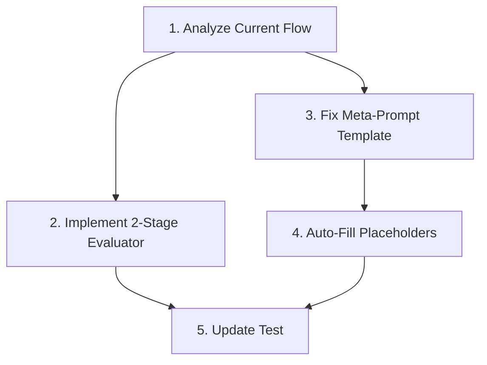

# BEAD Project Overview: Improve Prompt Optimization System

## Component Dependency Graph

## Build Order

### Phase 1: Understanding
1. **Analyze Current Optimization Flow** (no dependencies) - P0

### Phase 2: Core Features
2. **Implement 2-Stage Evaluator** (depends on: #1) - P1
3. **Fix Meta-Prompt Template** (depends on: #1) - P1

### Phase 3: Enhancement
4. **Auto-Fill Placeholders** (depends on: #3) - P2

### Phase 4: Integration
5. **Update Test with 2-Stage Evaluation** (depends on: #2, #4) - P2

## Component Summary Table

| # | Component | Purpose | Input | Output | Dependencies | Status |
|---|-----------|---------|-------|--------|--------------|--------|
| 1 | Analyze Current Flow | Document optimization process | Code files | Flow diagram + docs | None | ⏳ |
| 2 | 2-Stage Evaluator | Separate construction/reasoning eval | Predictions, GT | Construction score + Reasoning score | #1 | ⏳ |
| 3 | Fix Meta-Prompt | Generate complete prompts | Template | No placeholders | #1 | ⏳ |
| 4 | Auto-Fill Placeholders | Fallback for any {exampleN} | Prompt + train set | Filled prompt | #3 | ⏳ |
| 5 | Update Test | Test 2-stage evaluation | Dataset | Before/After metrics | #2, #4 | ⏳ |

## Overall Architecture

**Current Problem**:
- Meta-prompt generates templates with placeholders like `{examples1}`
- Placeholders not filled → confuses LLM → worse performance
- No separate evaluation for construction vs reasoning quality

**Solution**:
1. **Understand** current optimization flow (how meta-prompt works)
2. **Implement** 2-stage evaluator (construction quality + reasoning correctness)
3. **Fix** meta-prompt template to instruct LLM: include actual examples
4. **Add** fallback auto-fill logic for any remaining placeholders
5. **Update** test to use 2-stage evaluation and report clear metrics

**Expected Outcome**:
- Optimized prompts with complete examples (no placeholders)
- Clear metrics: construction score vs reasoning score
- Better understanding of why optimization improves/degrades performance
